# 从零开始搭建扩散模型

> [!WARNING]
> 本文内容不完整，且已停止更新。

> 本文内容为《扩散模型从原理到实战（人民邮电出版社）》代码实践，本机为 macOS arm64 环境。

## 前置知识

- 在 Notebook 中，`Cell` 是可以单独执行的一段 Python 代码块，类似于多个单独的代码文件，但每个 `Cell` 在运行时共享变量和内存，例如：
  ```python
  x = 10
  y = x + 1
  ```
  ```python
  print(y)
  ```
  虽然它们属于不同的“文件”，但它们共享同一个 Python 进程，因此 `print(y)` 不会报错。

## 环境创建与导入

1. 在 PyCharm 中创建 conda 解释器，命名为 `build_diffusion_model` （建议小写+下划线）

2. 在 `build_diffusion_model` 环境中执行
  ```bash
  python -m pip install -U pip
  pip install torch torchvision  # 若使用CUDA，需使用selector选择CUDA版本
  pip install diffusers matplotlib
  ```
  ```bash
  python -c "import torch; print(torch.backends.mps.is_available())"
  ```

3. 导出当前解释器环境以便复现
  ```bash
  conda env export --no-builds > environment_macosx.yml
  ```

4. 编写 Cell 实现模型的训练管线 `mnist_baseline.ipynb`
  ```python
  """
  依赖自检
  """

  import sys
  import importlib.util

  print(f"{'='*10} 执行依赖自检 {'='*10}")

  required_packages = [
      ("torch", "PyTorch" ),
      ("torchvision", "TorchVision"),
      ("diffusers", "Diffusers"),
      ("matplotlib", "Matplotlib")
  ]

  missing_packages = []

  for package_name, display_name in required_packages:
      if importlib.util.find_spec(package_name) is None:
          missing_packages.append(package_name)
      else:
          module = __import__(package_name)
          version = getattr(module, '__version__', '未知版本')
          print(f"{display_name}: {version}")

  if missing_packages:
      print(f"\n【ERROR】缺少以下依赖包: {', '.join(missing_packages)}")
      sys.exit(1)
  else:
      try:
          import torch
          import torchvision
          from torch import nn
          from torch.nn import functional as f
          from torch.utils.data import DataLoader
          from diffusers import DDPMScheduler, UNet2DModel
          from matplotlib import pyplot as plt
      except Exception as e:
          print(f"【ERROR】导入发生未知错误")
          sys.exit(1)

  print(f"{'='*10} 依赖自检完成 {'='*10}")
  ```
  ```python
  """
  Device 自检
  Apple Silicon：优先 mps，否则 cpu
  NVIDIA：优先 cuda，否则 cpu
  """

  print(f"{'='*10} 执行硬件自检 {'='*10}")

  try:
      if torch.backends.mps.is_available():
          device_name = "mps"
          if torch.backends.mps.is_built():
              print("【INFO】Use Apple Silicon (MPS)")
      elif torch.cuda.is_available():
          device_name = "cuda"
          print("【INFO】Use NVIDIA")
      else:
          device_name = "cpu"
          print("【INFO】Use CPU")

      device = torch.device(device_name)
      x = torch.ones(1).to(device)  # 在CPU中创建张量，并将其移动至device，赋值给x
      print(f"{device} 可以使用")

  except Exception as e:
      print(f"【ERROR】{e} 设备无法使用")
      device = torch.device("cpu")

  print(f"{'='*10} 硬件自检完成 {'='*10}")
  ```
  ```python
  """
  数据集测试
  """

  # 数据集
  dataset = torchvision.datasets.MNIST(
                                  root="../data/datasets",
                                  train=True,                                  # 使用训练集，False为测试集
                                  download=True,                               # 下载数据集
                                  transform=torchvision.transforms.ToTensor()  # 将图像转换为张量
                                  )

  # 为数据集创建数据加载器
  dataset_loader = DataLoader(
                  dataset,        # 要加载的数据对象
                  batch_size=16,  # 每次迭代加载的样本数量
                  shuffle=True    # 打乱数据顺序
                  )

  # 从加载器中取出第一批数据
  x, y = next(iter(dataset_loader))
  print('Input shape:', x.shape)
  print('Labels :', y)
  plt.imshow(torchvision.utils.make_grid(x)[0], cmap = 'gray')  # 以单通道取出所有图像，拼接成大图并用灰度显示
  ```
  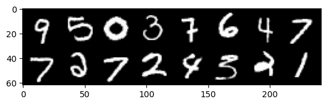

编写此管线的目的是测试硬件是否可调用。

## 模型的退化过程（前向过程）

在扩散模型中，“退化过程”指的是**数据信息逐渐丧失的过程**。狭义上理解就是不断向图像中添加高斯噪声的过程，直到图像完全变成各向同性的高斯噪声。

退化过程是扩散模型训练流程的一部分。扩散模型的整个训练流程可以简单归纳为：

```python
准备数据 → 向数据中添加噪声 → 模型预测加进去了哪些噪声 → 计算与真实误差 → 调整权重
```

模型的产出过程（反向过程）则大致与上面的流程相反。从纯噪声开始，根据学到的经验预测并一步步移除噪声，就得到了产物。

当然，前向和反向过程都涉及复杂的数学原理，这里不展开叙述（我也看不懂）。

前面我们已经准备好了数据集，为了训练模型，我们需要往训练集中人为添加噪声。

为了查看不同噪声程度下的图片，我们可以引入一个变量来手动控制内容“损坏”的程度。

如下方的代码所示。其中 `amount` 是我们引入的、人为控制的变量，`x` 为图像张量，`noise` 为噪声，`noise_x` 为加了噪声后的张量。

```python
noised_x = (1-amount) * x + amount * noise
```

可以看出，当 `amount` = 0 时，`noise_x` 与原始张量相同；当 `amount` = 1 时，`noise_x` 则为纯粹的噪声。

这种方法在数学上叫做线性插值。

当然，`amount` 的值不是手动填写的，那样训练就太低效了。在深度学习中，我们通常不是一张一张地处理图片，而是成批（Batch）处理，我们通常会为这一批次里的每一张图随机生成一个不同的损坏程度。

`x` (图像张量) 的形状通常是 `[Batch_size, Channels, Height, Width]`。
例如在上面的代码中，输出的 Input shape 为 [16, 1, 28, 28]，表示一共有 16 张 1 通道的 28x28 图片。

问题在于：如果 `amount` 是 1 维的随机数，那么它直接乘以 4 维的张量会发生错误。

为了让 `amount` 能和 `x` 相乘，我们需要把 `amount` 从 1 维变成 4 维，形状变为 `[ , , , ]`。

于是，我们就需要用到 PyTorch 的 `.view()` 方法来改变张量的形状。

`.view(-1, 1, 1, 1)` 内有几个参数，其中 -1 表示自动计算一个批次的数量，其余的 1 都表示自动适配图片规格。其实整个方法都是起自动适配的作用。

```python
"""
添加噪声，并对输出结果进行可视化
"""

def corrupt(x, amount):
    """
    根据给定的amount值，向输入张量x中添加噪声，返回添加噪声后的张量
    """
    amount = amount.view(-1, 1, 1, 1)  # 调整amount形状以便广播
    noise = torch.rand_like(x)  # 生成与x形状相同的噪声
    return x * (1 - amount) + noise * amount

# 绘制输入数据
fig, axs = plt.subplots(2, 1, figsize=(12, 5))  # 画布行数，画布列数，画布大小。plt.subplots返回两个方法，第一个是画布对象fig，第二个是子图对象axs
plt.subplots_adjust(hspace=0.4)  # 扩大子图间距
axs[0].set_title('Input Images')
axs[0].imshow(torchvision.utils.make_grid(x)[0], cmap='gray')  # 以单通道取出所有图像，拼接成大图并用灰度显示

# 加入噪声
amount = torch.linspace(0, 1, x.shape[0])  # 在指定的范围内，生成一组等距离的数字，数量与x的Batch_size相同
noised_x = corrupt(x, amount)

# 绘制加入噪声后的图像
axs[1].set_title('Corrupted Images (--- amount increases --->)')
axs[1].imshow(torchvision.utils.make_grid(noised_x)[0], cmap='gray')
```

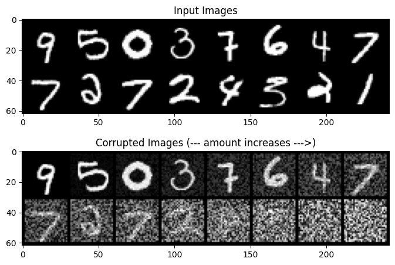

*我们可以发现，当噪声量接近 1 时，数据看起来像是随机的噪声图。*

## 模型的训练过程

我们可以参考 UNet 神经网络的架构来预测噪声，最终输出剔除噪声后的结果。

UNet 架构预测噪声的流程如下：

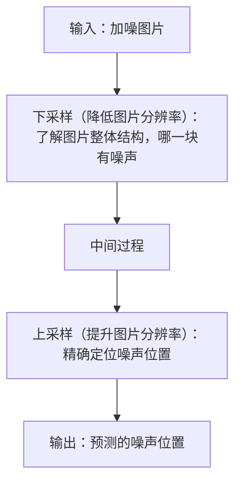

下采样分为以下几个步骤：

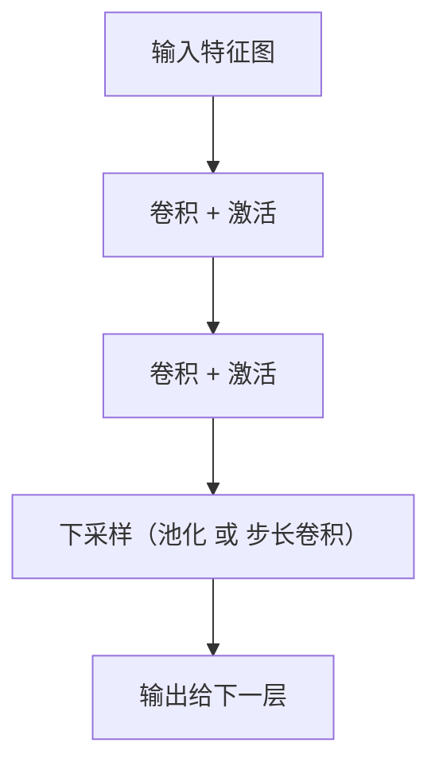

- 卷积：一个数学运算动作。指卷积核在输入图像上“滑动”，并进行“乘加运算”的过程。
    - 卷积层：一个容器。封装了卷积核、偏置项（Bias）以及上述的卷积运算规则。
          - 卷积核：本质上是一个很小的数字矩阵（权重矩阵）。

- 激活：将卷积生成的线性函数变为分段函数。
  > 现实世界的生成规则本身就是“条件触发 + 局部规则叠加”的，这种规则在数学上必然表现为“分段的、拼接的、非线性函数”。因此单一的线性函数无法拟合现实世界。
  >
  > 例如判断：
  >
  > > “一个像素是不是边缘？”
  >
  > 真实规则类似为：
  >
  >   - 如果左边亮、右边暗 → 是边缘
  >
  >   - 如果上边亮、下边暗 → 是边缘
  >
  >   - 如果整体都差不多亮 → 不是边缘
  >
  > 以 ReLU 函数为例：
  >
  > ```text
  > ReLU(x) = max(0, x)
  > ```
  >
  > 第一层卷积后：
  >
  > ```text
  > y=2x−2
  > ```
  >
  > 激活：
  >
  > ```text
  > h=ReLU(y)=max(0,2x−2)
  > ```
  >
  > 第二层卷积后：
  >
  > ```text
  > z=3h+1
  > ```
  >
  > 代入几个 `x` 后可以发现变成了分段函数：
  >
  > | x | z |
  > | --- | --- |
  > | 0 | 1 |
  > | 1 | 1 |
  > | 2 | 7 |
  > | 3 | 13 |
  >
  >   - 在 `x ≤ 1` 的时候，输出**完全不变**（一直是 1）
  >
  >   - 在 `x > 1` 的时候，输出开始**按直线快速增长**

- 池化：下采样的一种方式。最常见的是**最大池化**，即保留一片区域中的最显眼特征。还有一种操作是**平均池化**。
  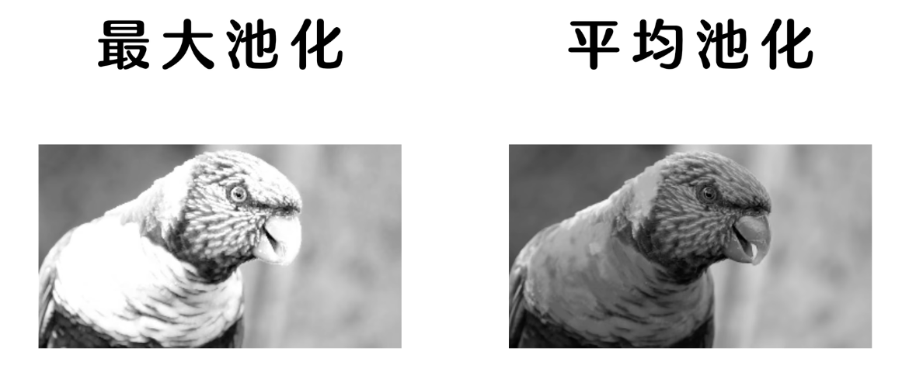
  设池化窗口为 2x2，采用最大池化，用数字演示就是最大的值：
  |  |  |  |  |
  | --- | --- | --- | --- |
  | 1 | 2 | 3 | 4 |
  | 0 | -1 | 8 | -6 |
  | 6 | -3 | 7 | 0 |
  | 3 | 2 | -1 | -9 |
  池化后，我们可以得到一个新的 2x2 表格：
  |  |  |
  | --- | --- |
  | 2 | 8 |
  | 6 | 7 |
  引入池化层可以提高模型的**平移不变性**，即当输入存在少量平移时，输出的结果不会产生很大影响。

- 步长卷积：卷积核滚动过程中，会跳过特定步长区域的值。

```python
class BasicUnet(nn.Module):
    """
    一个简单的UNet网络部署
    """
    def __init__(self, in_channels=1, out_channels=1):
        super().__init__()  # 初始化

        # 下采样路径，包含三个卷积层
        self.down_layers = torch.nn.ModuleList([
            nn.Conv2d(in_channels, 32, kernel_size=5, padding=2),  # 由输入通道数生成32个特征图，卷积核大小为5x5，填充为2以保持尺寸
            nn.Conv2d(32, 64, kernel_size=5, padding=2),  # 由32个特征图生成64个特征图
            nn.Conv2d(64, 64, kernel_size=5, padding=2),  # 不继续上升通道，防止过拟合
        ])

        # 上采样路径，包含三个转置卷积层
        self.up_layers = torch.nn.ModuleList([
            nn.ConvTranspose2d(64, 64, kernel_size=5, padding=2),
            nn.ConvTranspose2d(64, 32, kernel_size=5, padding=2),
            nn.ConvTranspose2d(32, out_channels, kernel_size=5, padding=2),
        ])
        self.act = nn.SiLU()  # 激活函数
        self.downscale = nn.MaxPool2d(2)  # 下采样使用最大池化法，窗口大小为2x2
        self.upscale = nn.Upsample(scale_factor=2)  # 上采样使用插值法
    
    def forward(self, x):
        h = []  # 创建一个空列表，保存下采样前的数据供上采样参考，以免上采样时丢失信息
        # 下采样循环 (Encoder)
        for i, l in enumerate(self.down_layers):
            x = self.act(l(x))        # 卷积 -> 激活
            if i < 2:                 # 前两层卷积层执行以下操作
                h.append(x)           # 把当前特征图存入 h 列表
                x = self.downscale(x) # 池化
        # 上采样循环 (Decoder)
        for i, l in enumerate(self.up_layers):
            if i > 0:                 # 除了第一个上采样层外，其他层都执行以下操作    
                x = self.upscale(x)   # 插值
                x = x + h.pop()       # 与对应的下采样特征图相加（跳跃连接）
            x = self.act(l(x))        # 转置卷积 -> 激活
        return x  # 返回预测的噪声
```

需要额外说明的几个点：

1. 卷积核大小通常为奇数。偶数大小的效果不好。

2. `padding` 是额外填充的内容
  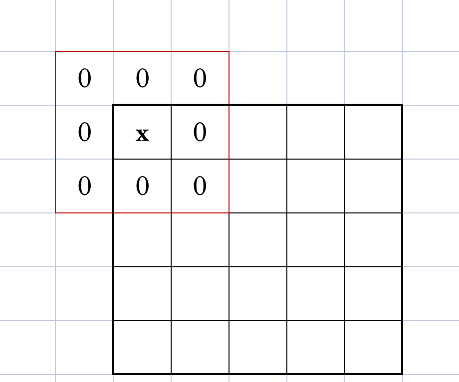
  > 设红色为 3x3 卷积核，当卷积核中心对准左上角第一个值时，部分卷积核会跃出边界。然而边界外的值是不存在的，于是我们就需要填充一个“虚拟边界”防止跨界问题。边界的宽度就是 `padding`。图中的 padding 值为 1。若卷积核为 5x5，padding 值就为 2。

完成一个简单的 UNet 网络后，我们可以验证输出结果的形状与输入的形状是否相同。同时查看整个网络的参数大小。

```python
"""
验证输入和输出的形状是否相同，并查看 UNet 网络的参数量
"""

net = BasicUnet()
x = torch.rand(8, 1, 28, 28)  # 生成形状 (8,1,28,28) 的随机张量
net(x).shape  # 将随机张量丢进网络，查看输出形状是否与输入相同
print(net(x).shape)

sum(p.numel() for p in net.parameters())  # 计算网络的参数量
```

```text
torch.Size([8, 1, 28, 28])
309057
```

现在给定一个带噪的输入 `noisy_x`，扩散模型应该输出对原始输入 `x` 的最佳预测。同时，我们需要通过均方误差比较预测值与真实值。总体流程如下：

1. 获取一批数据

2. 添加随机噪声

3. 将数据输入模型

4. 对模型预测与初始图像进行比较，计算损失更新模型的参数

```python
"""
开始训练模型
"""

batch_size = 512

# 数据加载器
dataset_loader = DataLoader(
                dataset,                  # 要加载的数据对象
                batch_size = batch_size,  # 每次迭代加载的样本数量
                shuffle=True              # 打乱数据顺序
                )

# 运行周期
num_epochs = 3

# 创建 UNet 网络
net = BasicUnet().to(device)

# 损失函数（均方误差）
loss_fn = nn.MSELoss()

# 优化器，根据损失函数结果调整网络权重
optimizer = torch.optim.AdamW(net.parameters(), lr=1e-3)  # 学习率：1e-3

# 记录训练损失
loss_history = []

# 训练循环
for epoch in range(num_epochs):
    for x, y in dataset_loader:
        # 加载数据并添加噪声
        x = x.to(device)  # 加载数据
        noise_amount = torch.rand(x.shape[0]).to(device)  # 为每个样本生成一个随机的噪声数量
        noisy_x = corrupt(x, noise_amount)  # 向样本中添加噪声

        # 预测的噪声结果
        predicted_noise = net(noisy_x)

        # 计算损失
        loss = loss_fn(predicted_noise, x)  # 对比预测噪声与原始图像

        # 反向传播并更新权重
        optimizer.zero_grad()  # 清除之前的梯度
        loss.backward()        # 反向传播计算新的梯度
        optimizer.step()       # 更新权重

        # 记录损失
        loss_history.append(loss.item())

    # 输出每个 epoch 的损失均值
    avg_loss = sum(loss_history[-len(dataset_loader):]) / len(dataset_loader)
    print(f"Finished epoch {epoch}. Average loss: {avg_loss:05f}")

# 绘制损失曲线
plt.plot(loss_history)
plt.ylim(0, 0.1)
```

```text
Finished epoch 0. Average loss: 0.043167
Finished epoch 1. Average loss: 0.026925
Finished epoch 2. Average loss: 0.024780
(0.0, 0.1)
```

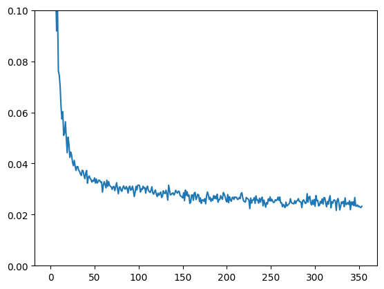

*损失曲线*

接下来可以看看模型预测的结果，对比原始、加噪后的图像是什么样的。

```python
"""
观察训练结果
"""

x, y = next(iter(dataset_loader))  # 从数据集中取出一批数据
x = x[:8]  # 取出前8个样本

amount = torch.linspace(0, 1, x.shape[0])  # 生成一组等距离的噪声数量
noised_x = corrupt(x, amount)  # 向样本中添加噪

# 得到模型预测结果
with torch.no_grad():  # 在评估模式下，不计算梯度
    predicted_noise = net(noised_x.to(device)).cpu()  # 预测噪声，将结果移回CPU（NumPy无法绘制GPU数据）

# 绘制结果
fig, axs = plt.subplots(3, 1, figsize=(12, 7))
axs[0].set_title('Input Images')
axs[0].imshow(torchvision.utils.make_grid(x)[0].clip(0, 1), cmap='gray')
axs[1].set_title('Corrupted Images (--- amount increases --->)')
axs[1].imshow(torchvision.utils.make_grid(noised_x)[0].clip(0, 1), cmap='gray')
axs[2].set_title('Predicted Noise')
axs[2].imshow(torchvision.utils.make_grid(predicted_noise)[0].clip(0, 1), cmap='gray')
```

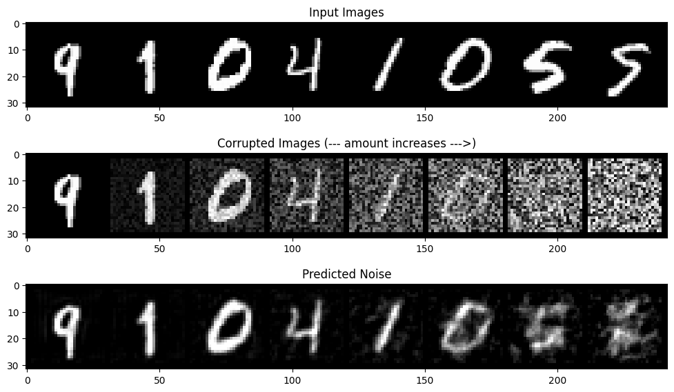

## 模型的采样过程

如上图所示，尽管模型在噪声量较少时的预测结果不错，但在噪声数量较高时结果几乎不准确。

我们可以通过拆解采样步骤来提高预测质量：例如将预测 20% 后的输出作为下一次预测的输入。

```python
"""
拆解采样步骤
"""

step = 5
x = torch.rand(8, 1, 28, 28).to(device)  # 随机初始化一个图像张量
step_history = [x.detach().cpu()]  # 每个步骤的图像
predicted_output = []  # 每个步骤的预测输出

for i in range(step):
    with torch.no_grad():
        predicted_image = net(x)  # 预测噪声
        predicted_output.append(predicted_image.detach().cpu())  # 记录预测输出

        mix_factor = 1/(step - i)  # 朝预测方向移动的步骤
        x = x * (1 - mix_factor) + predicted_image * mix_factor  # 更新图像
        step_history.append(x.detach().cpu())  # 记录当前步骤的图像

# 绘制每个步骤的图像和预测输出
fig, axs = plt.subplots(step, 2, figsize=(9, 4), sharex=True)
axs[0, 0].set_title('Input Image')
axs[0, 1].set_title('Predicted Noise')
for i in range(step):
    axs[i, 0].imshow(torchvision.utils.make_grid(step_history[i])[0].clip(0, 1), cmap='gray')
    axs[i, 1].imshow(torchvision.utils.make_grid(predicted_output[i])[0].clip(0, 1), cmap='gray')
```


*训练轮数过小时，生成质量不佳。此图在 num_epochs = 50，batch_size = 128 下得出。*

## DDPM 算法与 UNet2DModel

下面我们使用另一种神经网络架构：**UNet2DModel** 来训练模型。

UNet2DModel 使用了 DDPM 算法，同时引入了注意力机制，其架构和性能比 UNet 更加先进。

> [!NOTE]
> **注意力机制**
>
>
> > 没错，就是那个 LLM 的注意力机制**《Attention is All You Need》**。
>
> 现在的 LLM（大语言模型）和高级扩散模型（如 Stable Diffusion），包括一些视频生成模型等背后的核心架构都是 Transformer 的变体。
>
> 在 2017 年 Google 发布的一篇名为 **《Attention is All You Need》**的论文中，Transformer 架构首次问世并提出了注意力机制。这个机制彻底颠覆了以往处理序列数据（如文字、时间序列）和图像数据的方法。
>
> 在 Transformer 出现之前，AI 的底层逻辑主要是靠 RNN（循环神经网络） 和 CNN（卷积神经网络）。RNN 常用于处理语音、文本序列，CNN 常用于处理图像序列。**我们上面用到的经典 UNet 神经网络架构就是基于 CNN 的。**
>
> 这两种架构都存在一定问题：RNN 记性差、无法做到并行计算；CNN 卷积核只能看到局部，很难理解图像中相距很远的两部分之间的逻辑关系，生成的图像会出现牛头不对马嘴的情况。引入注意力机制，就能让图片中的所有像素关联起来。
>
> 在 **Stable Diffusion** 这种可以通过文字生成图片的模型中，Attention 还有一个更高级的用法叫 **Cross-Attention（交叉注意力机制）**。图片不仅与自身关联，也与输入的 **Prompt**关联。
>
> 但由于计算量很大，Attention 通常只放在 UNet 图像尺寸最小的那几层（瓶颈层或采样中间层）以提高训练效率。

由于引入了两层注意力算子，**UNet2DModel** 的训练时间很长，我这里调整了一下代码，尝试使用 Metal API 加速（我也不知道有没有用）。

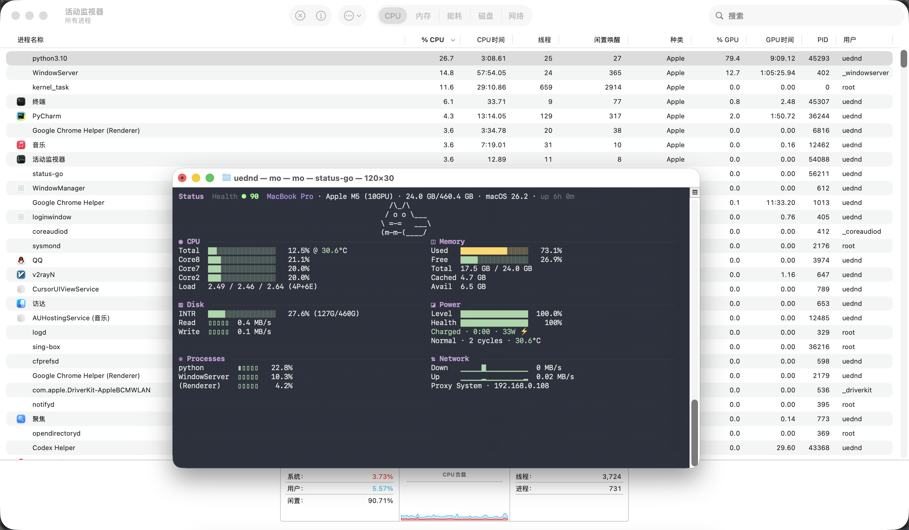

*训练时的整机功耗来到了 33W，约 4 分钟完成一个 epoch（比谷歌的 TPU 还快？）*

同样是 3 轮 epoch，训练完的损失率比经典 UNet 还高，这是怎么会事呢？


*经典 UNet*

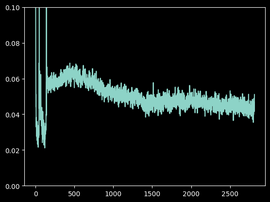

*UNet2DModel*


*经典 UNet*

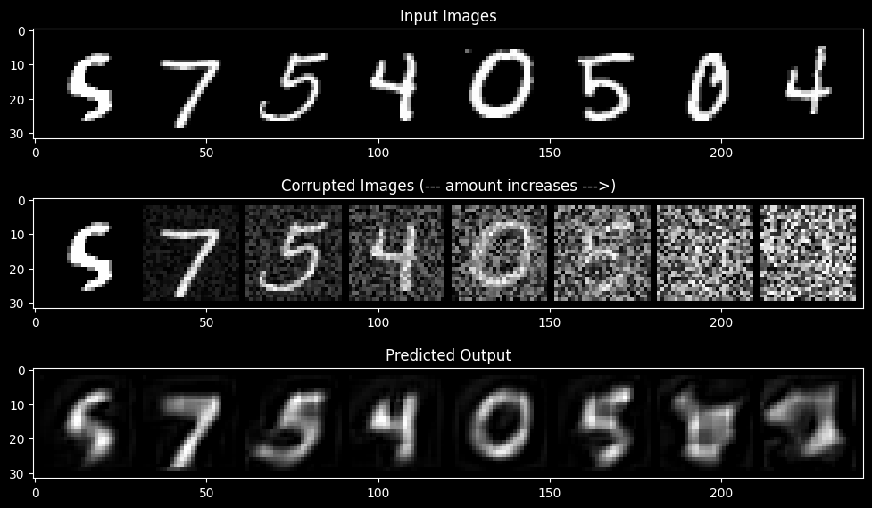

*UNet2DModel*

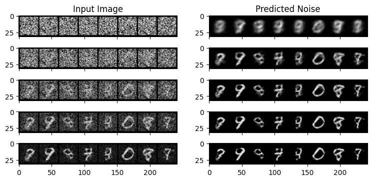

*经典 UNet*

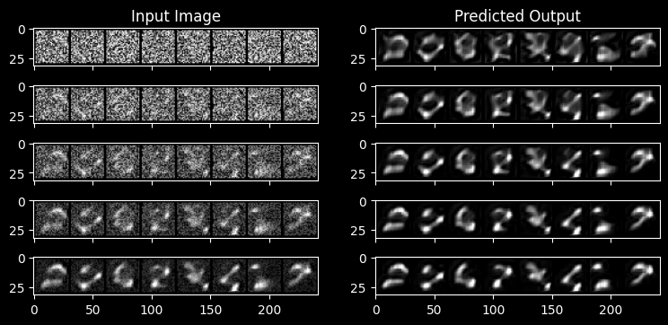

*UNet2DModel*

## 生成蝴蝶图像

需要先注册 Hugging Face 并获取 Access Token，便于上传模型。

```python
"""
依赖自检
"""

import sys
import os
from pathlib import Path

project_root = Path.cwd().parent
sys.path.insert(0, str(project_root / 'src'))

env_path = project_root / '.env'
if env_path.exists():
    for line in env_path.read_text().splitlines():
        line = line.strip()
        if not line or line.startswith('#') or '=' not in line:
            continue
        key, value = line.split('=', 1)
        value = value.strip().strip("'").strip('\"')
        os.environ.setdefault(key.strip(), value)


from diffusion.env import ensure_dependencies

ensure_dependencies()

import torch
from torch.nn import functional as f
from torchvision import transforms
from datasets import load_dataset

"""
Device 自检
"""

from diffusion.env import select_device

device = select_device(torch)

"""
加载数据集
"""
from diffusion.data import create_dataloader
from diffusion.hf import login_hf

login_hf()

dataset = load_dataset('huggan/smithsonian_butterflies_subset', split='train')

image_size = 32
batch_size = 64

# 图像预处理
preprocess = transforms.Compose(
    [
        transforms.Resize((image_size, image_size)),  # 统一图像大小（宽x高）
        transforms.RandomHorizontalFlip(),            # 随机水平翻转图像
        transforms.ToTensor(),
        transforms.Normalize([0.5], [0.5]),           # 归一化到 [-1, 1]
    ]
)

def transform(examples):
    """对数据集中的图像进行预处理"""
    images = [preprocess(image.convert("RGB")) for image in examples['image']]
    return {'images': images}

# 动态函数，获取数据集内容时，对数据集进行转换
dataset.set_transform(transform)

train_dataloader = create_dataloader(
    dataset,
    batch_size=batch_size
)

"""
可视化图像数据
"""

from PIL import Image
from diffusion.visualize import show_images

xbatch = next(iter(train_dataloader))['images'].to(device)[:8]
print(f'批量图像张量形状: {xbatch.shape}')  # torch.Size([8, 3, 32, 32])
show_images(xbatch).resize((8 * 64, 64), resample=Image.NEAREST)
```

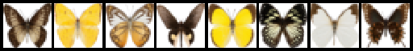

在模型的训练阶段中，我们需要获取这些输入图像并为它们添加噪声，然后将“带噪”的图像输入模型；在推理阶段，我们将使用模型的预测结果逐步消除这些噪声。

在扩散模型中，这两个步骤是由调度器(scheduler)处理的。

下面为图像添加噪声：

```python
"""
为图像添加噪声
"""

from diffusers import DDPMScheduler

noise_scheduler = DDPMScheduler(
    num_train_timesteps=1000
)

timesteps = torch.linspace(0, 999, 8).long().to(device)  # 8 个时间步
noise = torch.randn_like(xbatch)  # 生成随机噪声
noisy_xbatch = noise_scheduler.add_noise(xbatch, noise, timesteps)  # 添加噪声
print(f'添加噪声后的图像张量形状: {noisy_xbatch.shape}')  # torch.Size([8, 3, 32, 32])
show_images(noisy_xbatch).resize((8 * 64, 64), resample=Image.NEAREST)
```

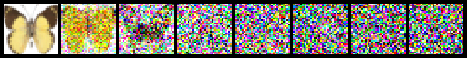

下一步应该是定义模型了。前面我们已经学习过 UNet 模型的基本结构。

```python
"""
创建扩散模型
"""

from diffusers import UNet2DModel

model = UNet2DModel(
    sample_size=image_size,        # 输入图像的大小（宽和高）
    in_channels=3,                 # 输入图像的通道数（RGB 图像为 3）
    out_channels=3,                # 输出图像的通道数
    layers_per_block=2,            # 每个块中的层 ResNet 层数
    block_out_channels=(64, 128, 128, 256),  # 每个块的输出通道数
    down_block_types=(             # 下采样块类型
        "DownBlock2D", 
        "DownBlock2D", 
        "AttnDownBlock2D", 
        "AttnDownBlock2D"
    ),
    up_block_types=(               # 上采样块类型
        "AttnUpBlock2D", 
        "AttnUpBlock2D", 
        "UpBlock2D", 
        "UpBlock2D"
    )
).to(device)
```

```python
"""
创建训练循环
"""

import numpy as np
from matplotlib import pyplot as plt

noise_scheduler = DDPMScheduler(
    num_train_timesteps=1000,
    beta_schedule="squaredcos_cap_v2"
)

optimizer = torch.optim.AdamW(model.parameters(), lr=1e-4)

losses = []

num_epochs = 50

for epoch in range(num_epochs):
    for step, batch in enumerate(train_dataloader):
        clean_images = batch['images'].to(device)
        # 1. 生成噪声
        noise = torch.randn(clean_images.shape).to(clean_images.device)
        bsz = clean_images.shape[0]
        # 2. 为每张图像随机选择时间步
        timesteps = torch.randint(
            0,                                   # 最小时间步
            noise_scheduler.num_train_timesteps, # 最大时间步
            (bsz,),                              # 生成 bsz 个时间步
            device=clean_images.device
        ).long()
        # 3. 根据每个时间步的噪声大小，添加噪声
        noisy_images = noise_scheduler.add_noise(
            clean_images, 
            noise, 
            timesteps
        )
        # 4. 预测噪声
        noise_pred = model(
            noisy_images,
            timesteps,
            return_dict=False
        )[0]
        # 5. 计算损失
        loss = f.mse_loss(noise_pred, noise)
        loss.backward(loss)
        losses.append(loss.item())
        # 6. 优化模型参数
        optimizer.step()
        optimizer.zero_grad()
    # 每 5 个周期打印一次损失
    if (epoch + 1) % 5 == 0:
        loss_last_epoch = sum(losses[-len(train_dataloader):]) / len(train_dataloader)
        print(f'Epoch {epoch+1}, Loss: {loss_last_epoch:.4f}')

# 绘制损失曲线
fig, axs = plt.subplots(1, 2, figsize=(12, 4))
axs[0].plot(losses)
axs[1].plot(np.log(losses))
plt.show()
```

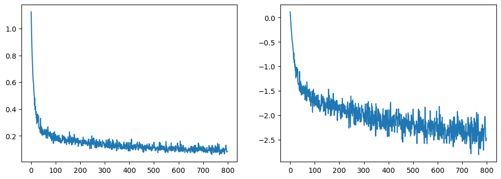

```python
"""
使用模型生成图像
"""

from diffusers import DDPMPipeline

# 创建图像生成管线
image_pipeline = DDPMPipeline(
    unet=model,
    scheduler=noise_scheduler
)

# 生成图像
pipeline_output = image_pipeline()
pipeline_output.images[0]
```

生成的图像如下：

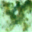

```python
"""
保存模型和管线
"""

image_pipeline.save_pretrained("../models/generate_butterflies")
```

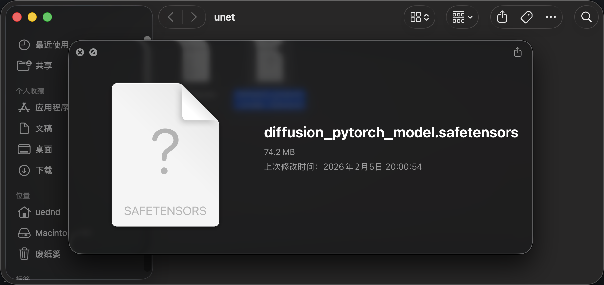

*可以看到我们训练的模型大小将近 74MB*

## 微调和引导

从上面的体验中可以得知，从头开始训练一个扩散模型需要很长的时间，且数据量也可能非常庞大。

对于这种情况，我们可以从一个已经训练过的模型开始训练——当你的新数据和原始模型的训练数据相似时。这种方法叫“微调”。例如若要生成卡通人脸，可以使用在人脸数据集上训练过的模型进行微调。

未施加生成条件的模型一般无法对生成的内容进行控制（例如控制图像的整体色调）。因此我们可以训练一个条件模型，使其接收额外输入，以此控制生成过程。对于没有生成条件的模型，可以使用引导函数。

将条件信息输入模型的方法有很多种：

- **将条件信息作为额外的通道输入**
  把条件信息直接和图像“捆”在一起。如果原图是 RGB 3 通道，条件图是 1通道，就把它们拼成一个 4 通道的输入送进模型第一层。这种方法受条件信息的影响很大，主要用于图生图、图像修复、超分辨率等任务。

- **特征融合**
  将条件转化成一个长向量，经变换后直接加到 UNet 中间每一层的特征图上。由于其为全局性指令，这种方法只能影响全局的风格、亮度和色调。

- **交叉注意力机制**
  上面已经解释过了。这种方法主要用于文生图。
